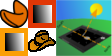
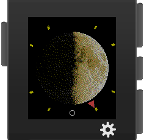
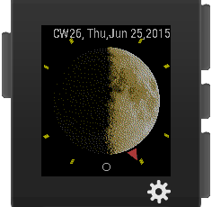
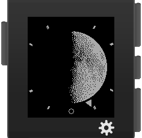
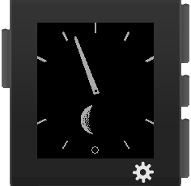
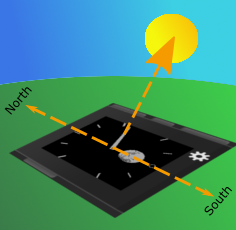
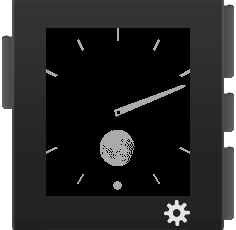

 pebble-samples
=================

Some sample projects for the Pebble Smart Watch using [pebble-js](https://github.com/pebble/pebblejs) and [pebble sdk 3.0](https://developer.getpebble.com/sdk)

__Pebble Fortune Cookies__
* Retrieve a [fortune text](http://tonycode.com/service/fortune-0.1/fortune.php)
* Display fortune cookie text from AJAX request on Pebble Watch Window

__Pebble Chuck says...__
* Retrieve a [Chuck Norris joke](http://api.icndb.com/jokes/random)
* Full service documentation on [The Internet Chuck Norris Database](http://www.icndb.com/api/)
* Display Chuck Norris joke text from AJAX request on Pebble Watch Window

Please mind: _All material retrieved by
[The Internet Chuck Norris Database](http://www.icndb.com/api/)
is intended for humorous entertainment purposes only. Any
related content should not be regarded as truth and is not
necessarily true._

__Pebble Moon for Northern Hemisphere__
* Moon for Northern Hemisphere is a watchface derived from [Decelerate Northern Hemisphere](https://github.com/OMerkel/pebble-samples/tree/master/pebble_decelerate_northern_hemisphere/c) watchface
* Main display is showing the current Moon Phase nearly in full screen
* Decelerate your day with a less stressful time display
* Exact time is shown by analog hour hand represented by a small triangle only
* On Accelerometer Event more time information like Calendar Week, Weekday, Day, Month, Year is shown

_The watchface shows a single hour hand only. The hour hand is represented by a triangle.
Midnight is on bottom of the watchface while Noon is indicated on top.
One rotation of the hour hand takes a whole day._

_On Accelerometer Event of the watch more detailed time information is
displayed for a specific while. On timeout the display toggles back to normal view._

[More...](https://github.com/OMerkel/pebble-samples/tree/master/pebble_moon_for_northern_hemisphere/c)

__Pebble Decelerate Northern Hemisphere__
* Decelerate your day with a less stressful time display
* Exact time is shown by analog hour hand only.
* Additional feature is the display of the current Moon phase

_The Decelerate Northern Hemisphere watchface shows a single hour hand only.
Midnight is on bottom of the clockface while Noon is indicated on top.
One rotation of the hour hand takes a whole day._

_An indicator for the seconds is blinking on bottom of the watchface._

_If holding the Pebble watch parallel over ground and turning it so the
hour hand is pointing towards the sun then top of the watch face will
always point in south direction and bottom of watch face in north
direction on northern hemisphere (Compass feature)._

_Additionally the current Moon phase is shown with more convenience for
observers of northern hemisphere. Moon phase display is expected to 
work until end of Unix Time (overflow on Jan 19th, 2038 03:14:07 GMT)
at least as implemented here._

[More...](https://github.com/OMerkel/pebble-samples/tree/master/pebble_decelerate_northern_hemisphere/c)

__Pebble Decelerate Southern Hemisphere__
* A version of the Pebble Decelerate watch face with more convenience for observers of the Moon from southern hemisphere.

_If holding the Pebble watch parallel over ground and turning it so the
hour hand is pointing towards the sun then top of the watch face will
always point in north direction and bottom of watch face in south
direction on southern hemisphere (Compass feature)._

_Here the current Moon phase is shown with more convenience for
observers of southern hemisphere. Moon phase display is expected to 
work until end of Unix Time (overflow on Jan 19th, 2038 03:14:07 GMT)
at least as implemented here._

[More...](https://github.com/OMerkel/pebble-samples/tree/master/pebble_decelerate_southern_hemisphere/c)

# Legal

See file named LICENSE being part of the repository.

Copyright (c) 2015

* __@AUTHOR__ Predrag Janjetovic, preddi(at)arcor(dot)de.
* __@AUTHOR__ Oliver Merkel, Merkel(dot)Oliver(at)web(dot)de.

All rights reserved.

Brands, logos and trademarks belong to their respective owners.

# Credits to

* _Tony Primerano_ for the _Fortune service_ provided and
* _The Internet Chuck Norris Database_ for their free offer of jokes and
* _Robert Reid_ for the MIT licensed [encoder.js](http://www.strictly-software.com/htmlencode) and
* _Katharine Berry_ for [cloudpebble](https://cloudpebble.net/)
* _Christian Robertson_ for the Roboto Condensed font licensed under Apache License, version 2.0

Thank you!
