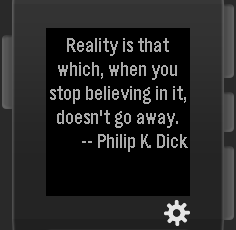
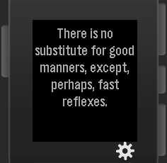
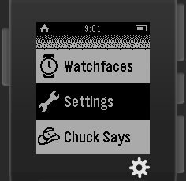
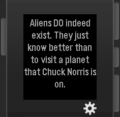
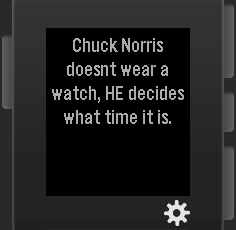

 pebble-js-samples
=================

Some sample projects for the Pebble Smart Watch using [pebble-js](https://github.com/pebble/pebblejs)

__Pebble Fortune Cookies__:
* Retrieve a [fortune text](http://tonycode.com/service/fortune-0.1/fortune.php)
* Display fortune cookie text from AJAX request on Pebble Watch Window

__Pebble Chuck says...__:
* Retrieve a [Chuck Norris joke](http://api.icndb.com/jokes/random)
* Full service documentation on [The Internet Chuck Norris Database](http://www.icndb.com/api/)
* Display Chuck Norris joke text from AJAX request on Pebble Watch Window

# Legal

See file named LICENSE being part of the repository.

Copyright (c) 2015

__@AUTHOR__ Predrag Janjetovic, preddi(at)arcor(dot)de.
__@AUTHOR__ Oliver Merkel, Merkel(dot)Oliver(at)web(dot)de.

All rights reserved.

Logos and trademarks belong to their respective owners.

# Credits to

* _Tony Primerano_ for the _Fortune service_ provided and
* _The Internet Chuck Norris Database_ for their free offer of jokes and
* _Robert Reid_ for the MIT licensed [encoder.js](http://www.strictly-software.com/htmlencode)
* _Katharine Berry_ for [cloudpebble](https://cloudpebble.net/)

Thank you!
