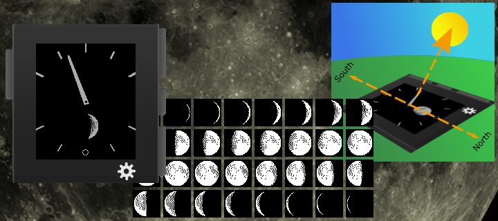
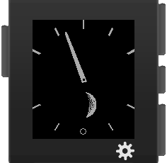
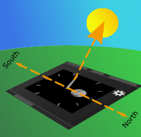
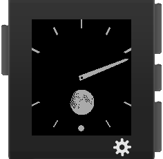

Pebble Decelerate Northern Hemisphere
=====================================

A sample project for the Pebble Smart Watch using [pebble sdk 3.0](https://developer.getpebble.com/sdk)

* Decelerate your day with a less stressful time display
* Exact time is shown by analog hour hand only.
* Additional feature is the display of the current moon phase

_The Decelerate Northern Hemisphere watchface shows a single hour hand only.
Midnight is on bottom of the clockface while Noon is indicated on top.
One rotation of the hour hand takes a whole day._

_An indicator for the seconds is blinking on bottom of the watchface._

_If holding the Pebble watch parallel over ground and turning it so the
hour hand is pointing towards the sun then top of the watch face will
always point in south direction and bottom of watch face in north
direction on northern hemisphere (Compass feature)._

_Additionally the current moon phase is shown for
northern hemisphere. Moon phase display is expected to work until end of
Unix Time (overflow on Jan 19th, 2038 03:14:07 GMT) at least as
implemented here._

# Legal

See file named LICENSE being part of the repository.

Copyright (c) 2015

* __@AUTHOR__ Oliver Merkel, Merkel(dot)Oliver(at)web(dot)de.

All rights reserved.

Brands, logos and trademarks belong to their respective owners.

# Credits to

* [NASA (National Aeronautics and Space Administration)](http://www.nasa.gov) for the _public domain images_ provided
    * [NASA Freedom of Information Act (FOIA)](http://www.nasa.gov/FOIA/index.html)
    * [Images](http://moon.nasa.gov/images.cfm) and [data](http://www.nasa.gov/moon) about the earth's moon

Thank you!
