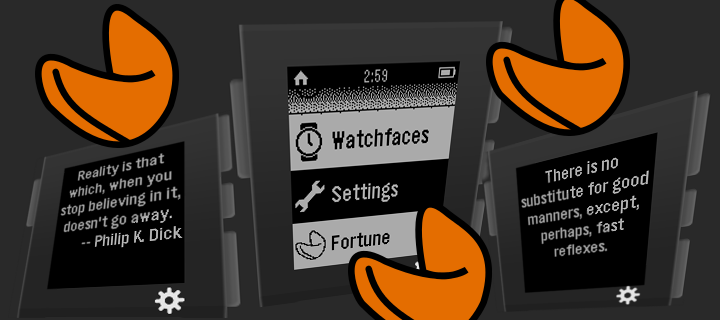

Pebble Fortune Cookies
======================

A sample projects for the Pebble Smart Watch using [pebble-js](https://github.com/pebble/pebblejs)

* Retrieve a [fortune text](http://tonycode.com/service/fortune-0.1/fortune.php)
* Display fortune cookie text from AJAX request on Pebble Watch Window

# Legal

See file named LICENSE being part of the repository.

Copyright (c) 2015

* __@AUTHOR__ Predrag Janjetovic, preddi(at)arcor(dot)de.
* __@AUTHOR__ Oliver Merkel, Merkel(dot)Oliver(at)web(dot)de.

All rights reserved.

Brands, logos and trademarks belong to their respective owners.

# Credits to

* _Tony Primerano_ for the _Fortune service_ provided and
* _Robert Reid_ for the MIT licensed [encoder.js](http://www.strictly-software.com/htmlencode) and
* _Katharine Berry_ for [cloudpebble](https://cloudpebble.net/)

Thank you!
