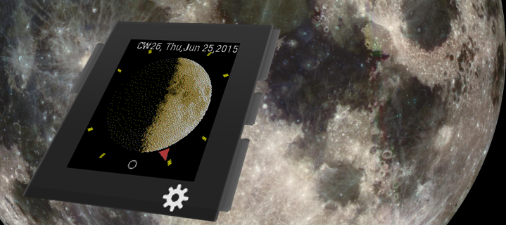

Pebble Moon for Northern Hemisphere
===================================

A sample project for the Pebble Smart Watch
using [pebble sdk 3.8.2](https://developer.getpebble.com/sdk)

* Moon for Northern Hemisphere is a watchface derived from [Decelerate Northern Hemisphere](https://github.com/OMerkel/pebble-samples/tree/master/pebble_decelerate_northern_hemisphere) watchface
* Main display is showing the current Moon Phase nearly in full screen
* Decelerate your day with a less stressful time display
* Exact time is shown by analog hour hand represented by a small triangle only
* On Accelerometer Event more time information like Calendar Week, Weekday, Day, Month, Year is shown

_The watchface shows a single hour hand only. The hour hand is represented by a triangle.
Midnight is on bottom of the watchface while Noon is indicated on top.
One rotation of the hour hand takes a whole day._

_On Accelerometer Event of the watch more detailed time information is
displayed for a specific while. On timeout the display toggles back to normal view._

# Compass Feature

If holding the Pebble watch parallel over ground and turning it so the
hour hand is pointing towards the sun then top of the watch face will
always point in south direction and bottom of watch face in north
direction <b>on northern hemisphere</b> (Compass feature).

Mind the observer's orientation and location: _The compass feature is
basically depending on the user's (or better the observer's)
orientation and position on Earth - respectively the latitude of
the observing position. At higher latitudes the compass feature
is easier to use and more fail safe. The Earth's
orbital plane around the sun projected onto the celestial sphere
is called ecliptic. The Earth's equatorial plane projected
onto the celestial sphere is called celestial equator.
The ecliptic and the celestial equator are oblique by an angle
of approximately 23.5 degrees currently. This means that
an observer standing at any position close to the Earth's equator
will lack a preferred view during noon (close to standing directly
perpendicular under the sun called the sun is in observer's zenith)
to point the hour hand towards the sun holding the watch parallel
over ground. Meaning the compass feature is either not working
at observer positions with smaller latitudes or the compass
feature is at least hard to apply._

Mind the difference of southern hemisphere and northern hemisphere:
_On southern hemisphere top of the watch face will indicate north
direction while bottom of watch face is oriented south._ 

# Moon Phase Display

_The current Moon phase is shown for
northern hemisphere. Moon phase display is expected to work until end of
Unix Time (overflow on Jan 19th, 2038 03:14:07 GMT) at least as
implemented here. For simplicity the axis of the Moon is shown
vertically on the watch face only._

Mind that observer will have a preferred viewing direction:
_The Moon's view on the sky might vary from upright vertical
orientation being rotated by a certain amount of degrees
depending on observer's latitude
and the current position of the sun. Regarding the observer's
location/latitude it shows itself close to
upside down between both hemispheres in direct comparison. The
inclination of the Moon's orbital plane towards the
plane of the Earth's equator has an
angle of approximately 5 degrees. For
simplicity assume that the Moon's orbital
plane equals the plane of the Earth's equator
neglecting the about 5 degrees angle. Such that on northern
hemisphere the Moon will always appear in south direction with
an observer usually and conveniently looking southward. On
southern hemisphere vice versa just the other way around.
Due to symmetry reason with an observer being near equator
there is less preference or convenience for choosing a
observation direction. The orientation of the crescent Moon can simlpy
be swapped by an upwards looking observer turning towards opposite
direction then._

_Anyway the Moon's crescent always points towards the sun._

# Legal

See file named LICENSE being part of the repository.

Copyright (c) 2016

* __@AUTHOR__ Oliver Merkel, Merkel(dot)Oliver(at)web(dot)de.

All rights reserved.

Brands, logos and trademarks belong to their respective owners.

# Credits to

* [NASA (National Aeronautics and Space Administration)](http://www.nasa.gov) for the _public domain images_ provided
    * [NASA Freedom of Information Act (FOIA)](http://www.nasa.gov/FOIA/index.html)
    * [Images](http://moon.nasa.gov/images.cfm) and [data](http://www.nasa.gov/moon) about the Earth's Moon
    * [Galileo spacecraft returned images of the Moon](http://photojournal.jpl.nasa.gov/catalog/PIA00405)
    * [JPL Image Use Policy](http://www.jpl.nasa.gov/imagepolicy)
* _Christian Robertson_ for the Roboto Condensed font licensed under Apache License, version 2.0

Thank you!
