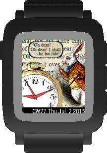

Pebble Watchface: Oh dear! Oh dear! I shall be too late!
========================================================

<blockquote>
<b>DOWN THE RABBIT-HOLE.</b>

... when suddenly a white rabbit with pink eyes ran close by her.

There was nothing so very remarkable in that; nor did Alice think
it so very much out of the way to hear the Rabbit say to itself,
"Oh dear! Oh dear! I shall be too late!" ... but when the Rabbit
actually took a Pebble watch out of its waistcoat-pocket, and
looked at it, and then hurried on, Alice started to her feet,
for it flashed across her mind that she had never before seen a
rabbit with either a waistcoat-pocket, or a Pebble watch to take
out of it, and, burning with curiosity, she ran across the field
after it, and was just in time to see it pop down a large
rabbit-hole under the hedge.
</blockquote>

_... from Lewis Carroll's "Alice in Wonderland"._

Trust this watch face and you will most likely be 5 minutes too late!

THE SOFTWARE IS PROVIDED "AS IS", WITHOUT WARRANTY OF ANY KIND...
even if you are too late. Have fun...

The White Rabbit being part of the background image is work from
[John Tenniel](https://en.wikipedia.org/wiki/John_Tenniel).
John Tenniel illustrated early editions of
[Lewis Carroll](https://en.wikipedia.org/wiki/Lewis_Carroll)'s "Alice
in Wonderland" back in 19th century.

Mind that works of John Tenniel and Lewis Carroll are in the public domain yet!
All other portions of this Pebble watchface are MIT licensed.

Links
-----

* [Sir John Tenniel](https://en.wikipedia.org/wiki/John_Tenniel), English illustrator,  *1820 - &#8224;1914
* [Lewis Carroll](https://en.wikipedia.org/wiki/Lewis_Carroll), English writer, *1832 - &#8224;1898
